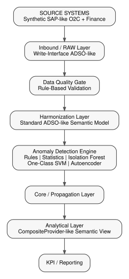

# Automated Semantic Data Quality and Anomaly Detection across SAP BW/4HANA LSA++

A research-grade, reproducible data-engineering project for **TechNova Manufacturing GmbH** that investigates semantic corruption detection in an Order-to-Cash / Sales & Finance warehouse. It combines deterministic validation, statistical methods, and unsupervised machine learning, and compares detector placement across LSA++-style layers.

> **Status:** executable **SAP BW/4HANA architectural emulation**. Python/CSV/SQL components in this repository are not SAP BW/4HANA objects. Real SAP ADSOs, transformations, DTPs, process chains and CompositeProviders are design targets documented under `sap_bw4hana/` until deployed in an actual system.



## Research problem
Enterprise warehouse records can be syntactically and technically valid while violating business semantics: wrong margins, stale exchange rates, incompatible units, currency inconsistencies, phantom deltas, broken references or impossible temporal sequences. This repository creates controlled ground truth and measures how different detectors behave.

## Research questions
- **RQ1 — Detection effectiveness:** compare rules, statistical methods, Isolation Forest, One-Class SVM and autoencoder using precision, recall, F1, FDR and related metrics.
- **RQ2 — Architectural placement:** compare inbound/staging versus harmonization placement, with an analytical layer extension available.
- **RQ3 — Computational overhead:** compare runtime, process memory delta, CPU utilization, throughput and batch detection latency.

## SAP BW/4HANA mapping

| Project component | Conceptual BW/4HANA mapping |
|---|---|
| Inbound raw layer | Inbound/Write-Interface ADSO |
| Harmonization | Standard ADSO |
| Transformations | BW Transformation |
| Batch load | DTP (**DTP-like simulation here**) |
| Orchestration | Process Chain |
| Core | LSA++ propagation/core |
| Analytical view | CompositeProvider |
| Reporting | BW Query |
| Anomaly service | External/adjacent analytical service |

## Data model
Synthetic master data includes Customer, Material, Plant, Warehouse, Sales Organization, Currency, Unit of Measure and Exchange Rate. Transactions include Sales Orders/Items, Deliveries/Items, Billing Documents/Items and Finance Postings. Business keys, surrogate keys, grain, cardinality and SCD-compatible attributes are documented in `docs/data_model.md`.

## Controlled anomaly taxonomy
Numeric drift, margin corruption, exchange-rate drift, UoM corruption, currency mismatch, phantom delta, referential-integrity corruption, temporal corruption and collective anomalies. Every corruption is logged in `anomaly_ground_truth` and a record-level ground-truth file also labels normal observations.

## Detection methods
- No-detection baseline for overhead comparison
- Rule registry with explainable rule failures
- Z-score and IQR statistical detection, plus rolling Z-score utility
- Isolation Forest
- One-Class SVM
- Reconstruction autoencoder (scikit-learn MLP bottleneck)

The ML models are unsupervised. Ground-truth labels are joined only for evaluation.

## Evaluation and benchmarking
Precision, Recall, F1, False Discovery Rate, false-negative rate and false-positive rate are computed from confusion-matrix counts. Runtime, RSS memory delta, process CPU percentage, records processed and throughput are captured for each detector/layer run. Batch MTTD is explicitly a processing-latency proxy in the emulator; it is not claimed to be real SAP production MTTD.

## Results
No numbers are hard-coded or fabricated. A real one-seed smoke benchmark has been executed and is documented in [`docs/measured_results.md`](docs/measured_results.md), with the measured CSV at `experiments/results/smoke_benchmark.csv`. It is explicitly **not** treated as an answer to RQ1–RQ3. New runs append to `experiments/results/experiment_results.csv`; plots are generated from measured data. Thesis claims should be made only after the configured repeated experiment matrix is executed and statistically analyzed.

## Reproducibility
```bash
python -m venv .venv
source .venv/bin/activate        # Windows: .venv\\Scripts\\activate
pip install -r requirements.txt
pip install -e .

# generate a small reproducible dataset
python -m tn_anomaly.cli generate --config config/small.yaml

# run all configured detectors across inbound + harmonization
python -m tn_anomaly.cli experiment --config config/small.yaml

# create thesis-style comparison plots
python -m tn_anomaly.cli plots --config config/small.yaml

# test
pytest
```

Docker:
```bash
docker compose -f docker/docker-compose.yml up --build
```

## Project structure
```text
config/                 experiment and data-generation configuration
data/                   raw, processed and ground-truth outputs
database/               optional SQL persistence / schema artifacts
docs/                   architecture, methodology and thesis support
experiments/             matrix configs, run artifacts and measured results
sap_bw4hana/             real-system design/mapping artifacts
src/tn_anomaly/          executable Python package
tests/                   unit and integration tests
```

## Limitations
Synthetic data, LSA++ architectural emulation, local DTP-like batch timing, simplified semantic rules, and a lightweight autoencoder limit direct production generalization. See `docs/limitations.md`.

## Future work
Deploy selected ADSO/transformation/DTP/process-chain objects in a real BW/4HANA environment; add authenticated extraction/result interfaces; execute multi-seed medium/large experiment matrices; add per-corruption statistical analysis and confidence intervals; validate operational monitoring and governance.

## Author
MSc Data Science / SAP Data Engineering portfolio project. Replace this section with the final author profile and repository contact before public release.
