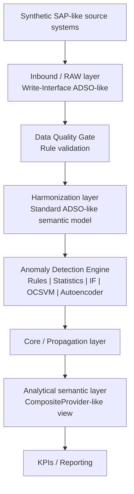

# Architecture

This project implements an **LSA++-style architectural emulation** around synthetic Order-to-Cash and Finance data for TechNova Manufacturing GmbH.

The diagram is also rendered as `docs/assets/architecture.svg`.

## Placement experiment

- **Inbound**: detection uses features plausibly available near staging. Fewer contextual features are available.
- **Harmonization**: detection uses enriched semantic features such as margin percentage, lead times, historical deviations, frequencies and ratios.
- **Analytical**: supported by the layer abstraction but not included in the default smoke benchmark.

The DTP-like runtime is a Python batch-processing simulation. It is not an SAP DTP runtime measurement.
